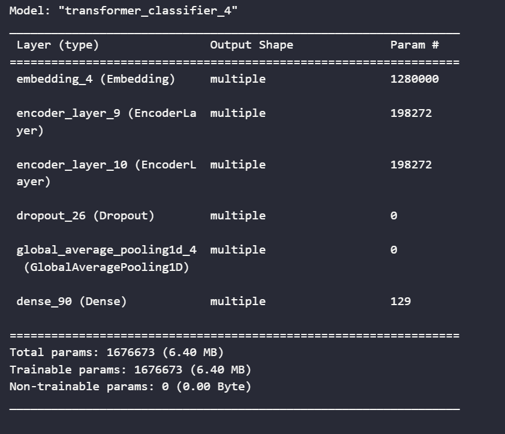

# Transformer Encoder For Classifier 

<p align="center">
    
</p>

This is my code about Transformer Encoder base on paper [Attention Is All You Need](https://doi.org/10.48550/arXiv.1706.03762)

Architecture Image 

Authors:
- Github: TranDucChinh
- Email: chinhtran2004@gmail.com

Advisors: 
- Github: bangoc123
- Email: protonxai@gmail.com

## I.  Set up environment
- Step 1:

```python
conda env create -f environment.yml
```

- Step 2:
```python
pip install -r requirements.txt
```
## II.  Set up your dataset

- Guide user how to download your data and set the data pipeline 
```
https://storage.googleapis.com/tensorflow/tf-keras-datasets/imdb.npz
```

## III. Training Process


There are some important arguments for the script you should consider when running it:

- `batch-size`
- `max-length`
- `vocab-size`
- `d-model`
- `num-encoder_layers`
- `num-heads`
- `dff`

- `dropout-rate`


Training script:


```python

!python train.py --batch_size ${batch-size} --num_epochs ${epochs} --d_model ${d-model} --max_length ${maxlength} --vocab_size ${vocab-size} --dff ${dff} --num_heads ${num-heads} --num_encoder_layers ${num-encoder-layers} --learning_rate ${learning-rate} --dropout ${dropout-rate}

```


Example:

```python

!python train.py --batch_size 32 --num_epochs 10 --d_model 128 --max_length 200 --vocab_size 10000 --dff 512 --num_heads 2 --num_encoder_layers 2 --learning_rate 0.001 --dropout 0.1 

``` 

## IV. Predict Process

```bash
python predict.py --test-data ${link_to_test_data}
```

## V. Result and Comparision

Your implementation
```
Epoch 7/10
782/782 [==============================] - 261s 334ms/step - loss: 0.8315 - acc: 0.8565 - val_loss: 0.8357 - val_acc: 0.7978
Epoch 8/10
782/782 [==============================] - 261s 334ms/step - loss: 0.3182 - acc: 0.8930 - val_loss: 0.6161 - val_acc: 0.8047
Epoch 9/10
782/782 [==============================] - 261s 333ms/step - loss: 1.1965 - acc: 0.8946 - val_loss: 3.9842 - val_acc: 0.7855
Epoch 10/10
782/782 [==============================] - 261s 333ms/step - loss: 0.4717 - acc: 0.8878 - val_loss: 0.4894 - val_acc: 0.8262

```

Other architecture

```
Epoch 6/10
391/391 [==============================] - 115s 292ms/step - loss: 0.1999 - acc: 0.9277 - val_loss: 0.4719 - val_acc: 0.8130
Epoch 7/10
391/391 [==============================] - 114s 291ms/step - loss: 0.1526 - acc: 0.9494 - val_loss: 0.5224 - val_acc: 0.8318
Epoch 8/10
391/391 [==============================] - 115s 293ms/step - loss: 0.1441 - acc: 0.9513 - val_loss: 0.5811 - val_acc: 0.7875
```


## VI. Feedback

If you have any issues when using this library, please let us know via the issues submission tab.


